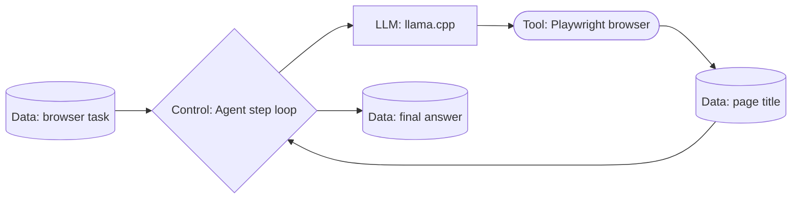
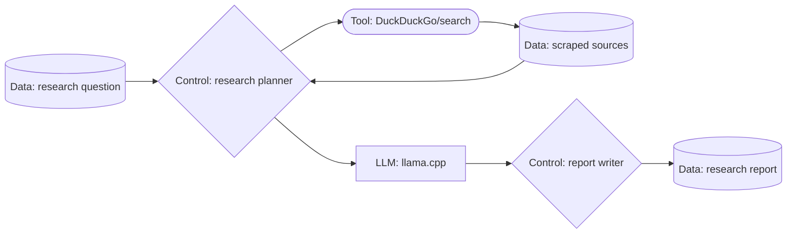
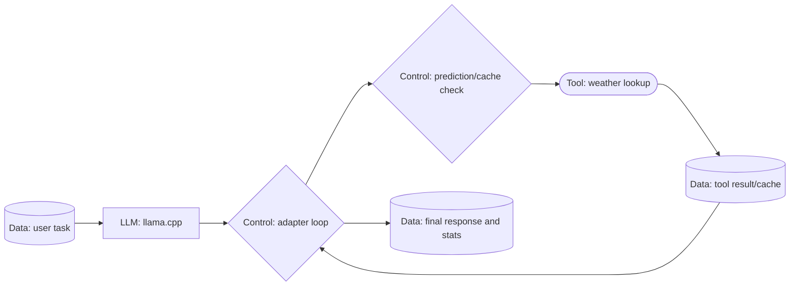
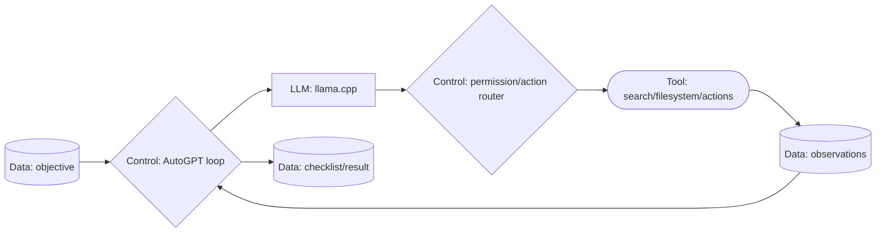
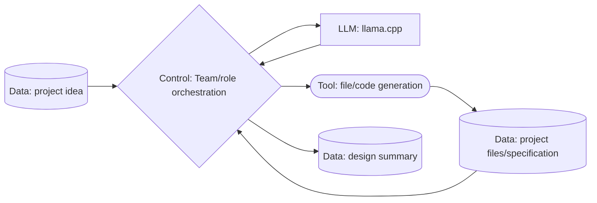
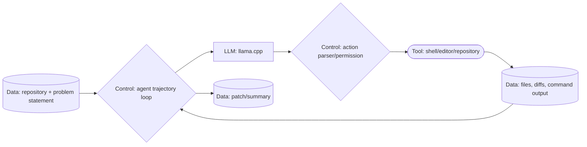
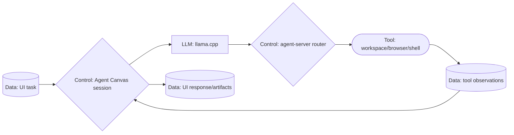

# Workflow execution graphs

These DAGs describe the execution shape exercised by the inputs in
`WORKFLOW_INPUTS.txt`. Node labels use the four profiling types:

- **LLM** — llama.cpp chat/completion request
- **Tool** — browser, search, code, or application tool invocation
- **Control** — workflow loop, planner, router, or cache decision
- **Data** — task, prompt, tool result, repository, or report data

## Browser Use

## GPT Researcher

## Speculative Tools

## AutoGPT

## MetaGPT

## SWE-agent

## OpenHands Agent Canvas

## Execution evidence

The dedicated runs produced profiled traces under `traces/`. Browser Use,
Speculative Tools, and MetaGPT completed successfully; GPT Researcher reached
report writing before its test timeout, AutoGPT reached its interactive agent
loop but exited on a terminal permission prompt, SWE-agent reached startup but
needs a clean per-run tool bundle, and OpenHands is intentionally long-running
as a UI service.
