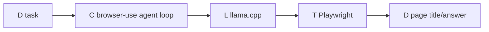
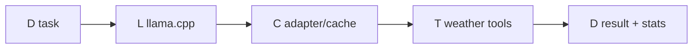
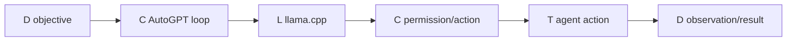
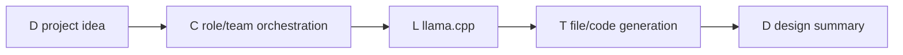
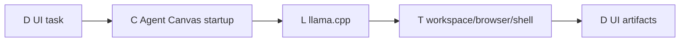

# Latest workflow DAGs and resource data

These are the graphs exported from the latest run (`2026-09-02`). `L` is an
LLM request, `T` a tool, `C` control/orchestration, and `D` data. LLM requests
are recorded by the separate proxy, so their CPU and RSS are unavailable.

## Browser Use — `traces/browser-use-20260902T070403Z`

| Node | CPU ms | Duration ms | Peak RSS |
|---|---:|---:|---:|
| browser-use agent loop | 10,459.798 | 142,392.656 | 224,894,976 B |
| llama.cpp completion ×4 | n/a | 35,432.678 + 32,901.458 + 28,174.890 + 41,816.767 | n/a |
| Playwright | n/a | included in agent loop | n/a |

## GPT Researcher — `traces/gpt-researcher-20260902T070631Z`

| Node | CPU ms | Duration ms | Peak RSS |
|---|---:|---:|---:|
| conduct_research | 49,930.320 | 44,227.482 | 1,931,538,432 B |
| llama.cpp completion ×2 | n/a | 2,642.112 + 25,666.826 | n/a |
| search/scrape | included above | included above | included above |

## Speculative Tools — `traces/speculative-tools-20260902T070931Z`

| Node | CPU ms | Duration ms | Peak RSS |
|---|---:|---:|---:|
| adapter agent loop | 1,806.143 | 9,587.979 | 121,901,056 B |
| llama.cpp completion | n/a | 7,994.398 | n/a |

## AutoGPT — `traces/autogpt-20260902T070944Z`

| Node | CPU ms | Duration ms | Peak RSS |
|---|---:|---:|---:|
| model discovery ×3 | n/a | 3.535 + 1.592 + 1.315 | n/a |
| llama.cpp completion | n/a | 126,652.123 | n/a |
| interactive workflow node | not completed in trace | n/a | n/a |

## MetaGPT — `traces/metagpt-20260902T071244Z`

| Node | CPU ms | Duration ms | Peak RSS |
|---|---:|---:|---:|
| MetaGPT workflow | 18,744.893 | 38,331.875 | 22,736,896 B |
| llama.cpp completion ×2 | n/a | 22,788.222 + 11,660.070 | n/a |

## SWE-agent — `traces/swe-agent-20260902T071322Z`

| Node | CPU ms | Duration ms | Peak RSS |
|---|---:|---:|---:|
| model request 1 | n/a | 76,303.709 | n/a |
| model request 2 | n/a | 75,344.954 | n/a |
| tool bundle/trajectory | not completed in trace | n/a | n/a |

## OpenHands Agent Canvas — `traces/openhands-20260902T071622Z`

| Node | CPU ms | Duration ms | Peak RSS |
|---|---:|---:|---:|
| Agent Canvas startup | n/a | 11,273.682 | n/a |
| LLM/tool nodes | n/a | not exercised by start-only smoke test | n/a |

Raw JSON/DOT/Mermaid graphs and critical-path reports are in each referenced
trace directory. Values are wall-clock milliseconds and bytes.

## Doubled-timeout retry

The previously incomplete workflows were rerun with
`WORKFLOW_RUN_TIMEOUT=360` (twice the prior 180-second bound):

| Workflow | Trace | Result | Captured resource data |
|---|---|---|---|
| GPT Researcher | `traces/gpt-researcher-20260902T072132Z` | timeout at 360 s | research node: CPU 156,840.940 ms, duration 107,714.861 ms, peak RSS 2,585,038,848 B; two LLM calls: 25,267.823 ms and 58,238.032 ms |
| AutoGPT | `traces/autogpt-20260902T072732Z` | timeout at 360 s | three model-discovery GETs: 3.331/1.869/1.378 ms; LLM call: 124,219.469 ms |
| SWE-agent | `traces/swe-agent-20260902T073347Z` | timeout at 360 s | three LLM calls: 124,158.655/125,124.149/77,373.002 ms |

The retry traces include fresh `graph.json`, `graph.dot`, `graph.mmd`, and
`critical-path.json` files. The doubled bound did not produce completion for
these three workflows because the 14B model spends most of the interval in
long context processing/generation.
